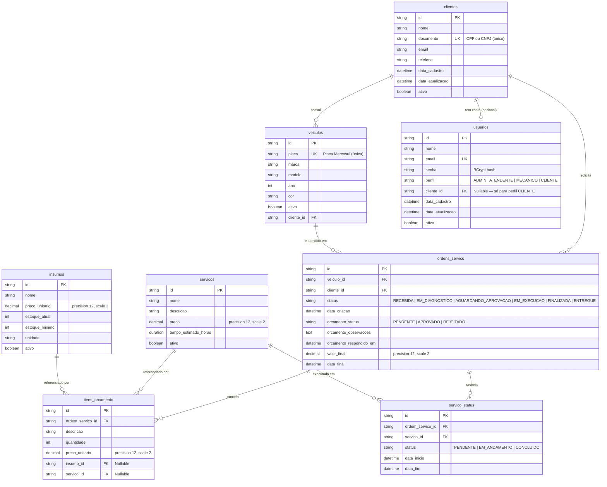
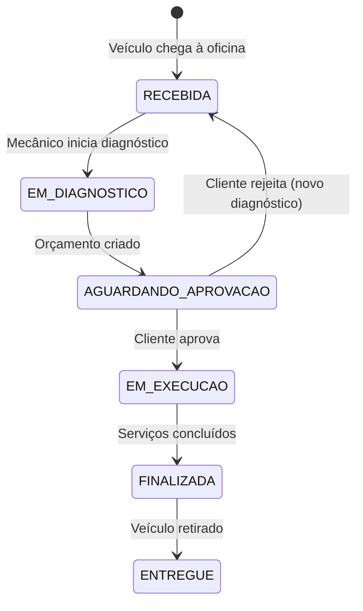

# 🗄️ Banco de Dados — Justificativa, Modelo Relacional e Diagrama ER

## Justificativa formal da escolha do PostgreSQL

### Contexto

A Oficina API gerencia clientes, veículos, ordens de serviço com orçamentos, serviços
e insumos — domínios com **relacionamentos bem definidos** e **integridade referencial
obrigatória**. A decisão do banco de dados impacta diretamente a consistência dos dados
financeiros (orçamentos, preços) e a rastreabilidade do ciclo de vida das ordens de serviço.

### Decisão

Adotar o **PostgreSQL 15** como banco de dados relacional, hospedado no **AWS RDS**
(instância `db.t3.micro`) para o ambiente de produção, e em container Docker para
desenvolvimento local.

### Critérios de avaliação

| Critério | PostgreSQL | MongoDB | DynamoDB |
|---|---|---|---|
| **Integridade referencial** | ✅ FKs, constraints, transactions ACID | ❌ Sem FKs nativas | ❌ Sem joins |
| **Modelo relacional** | ✅ Natural para o domínio (clientes ↔ veículos ↔ OS) | ⚠️ Desnormalização necessária | ⚠️ Modelagem por access patterns |
| **Consultas complexas** | ✅ JOINs, aggregations, subqueries | ⚠️ Aggregation pipeline | ❌ Limitado (Scan/Query) |
| **Compatibilidade Spring Data JPA** | ✅ First-class support (Hibernate) | ⚠️ Spring Data MongoDB (diferente) | ❌ Não suportado |
| **Custo no Learner Lab** | ✅ RDS Free Tier (`db.t3.micro`) | ⚠️ DocumentDB (caro) | ✅ Free Tier generoso |
| **Transações financeiras** | ✅ ACID completo, `SERIALIZABLE` | ⚠️ Multi-document transactions (4.0+) | ⚠️ TransactWriteItems (limitado) |
| **Maturidade do ecossistema** | ✅ 35+ anos, vastamente documentado | ✅ Maduro | ✅ Maduro (AWS-native) |

### Motivos da rejeição das alternativas

- **MongoDB:** O domínio é inerentemente relacional. Desnormalizar ordens de serviço com
  itens de orçamento, serviços e insumos geraria duplicação de dados e inconsistências em
  atualizações de preço. Além disso, o Spring Data MongoDB tem API diferente do JPA, o que
  quebraria a independência de framework na camada de domínio (Clean Architecture).

- **DynamoDB:** Excelente para key-value e access patterns simples, mas o domínio exige
  consultas por múltiplos filtros (ex: "todas as OS de um cliente com status EM_EXECUCAO"),
  joins entre entidades e transações que envolvem múltiplas tabelas. O custo de modelagem
  seria desproporcional ao benefício.

### Conclusão

O PostgreSQL é a escolha natural para um domínio com alta integridade referencial,
consultas relacionais complexas e transações financeiras, alinhado com a stack JPA/Hibernate
do Spring Boot e com custo viável no AWS Academy Learner Lab.

---

## Diagrama Entidade-Relacionamento (ER)

O diagrama a seguir representa todas as tabelas do sistema e seus relacionamentos,
mapeados a partir das entidades JPA em `oficina-adapters`.

---

## Explicação dos relacionamentos

### Cliente → Veículos (1:N)
Um cliente pode ter múltiplos veículos cadastrados. Cada veículo pertence a exatamente
um cliente (`cliente_id` NOT NULL na tabela `veiculos`). A exclusão lógica via flag `ativo`
preserva o histórico.

### Cliente → Ordens de Serviço (1:N)
Um cliente pode ter múltiplas ordens de serviço ao longo do tempo. O `cliente_id` na
ordem permite rastrear o proprietário mesmo que o veículo mude de dono.

### Cliente → Usuário (1:0..1)
Um cliente pode opcionalmente ter uma conta de usuário (perfil `CLIENTE`) para consultar
suas próprias ordens de serviço. Usuários com perfis `ADMIN`, `ATENDENTE` e `MECANICO`
não estão vinculados a clientes.

### Veículo → Ordens de Serviço (1:N)
Cada ordem de serviço está vinculada a exatamente um veículo. Um veículo pode ter
múltiplas ordens ao longo do tempo (manutenções recorrentes).

### Ordem de Serviço → Itens de Orçamento (1:N)
Cada OS pode conter múltiplos itens no orçamento, onde cada item referencia opcionalmente
um **serviço** (mão de obra) ou um **insumo** (peça/material). O `CASCADE` em
`orphanRemoval` garante que itens sejam excluídos junto com a OS.

### Ordem de Serviço → Serviço Status (1:N)
Rastreia o progresso de cada serviço individual dentro da OS. Permite saber quais
serviços já foram iniciados, estão em andamento ou foram concluídos, com timestamps
de início e fim.

### Serviços e Insumos → Itens de Orçamento (1:N)
Um serviço ou insumo pode aparecer em múltiplos orçamentos de diferentes ordens.
O preço unitário é gravado no item do orçamento (snapshot), não derivado do catálogo,
para preservar o valor histórico mesmo que o preço do catálogo mude.

---

## Ciclo de vida da Ordem de Serviço

Cada transição de status é validada no domínio (`OrdemServico.java`), garantindo que
transições inválidas (ex: `RECEBIDA → FINALIZADA`) sejam rejeitadas independentemente
da camada que invoque a operação.
