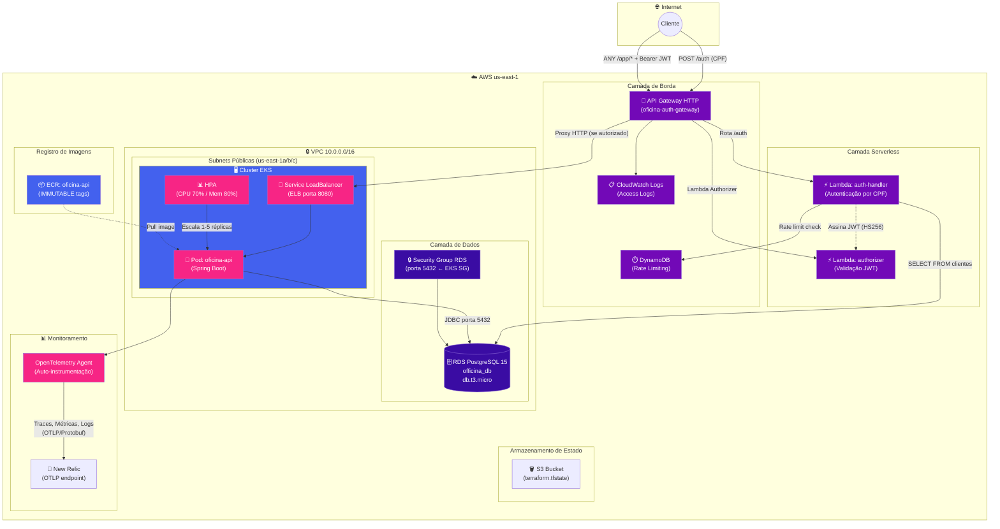
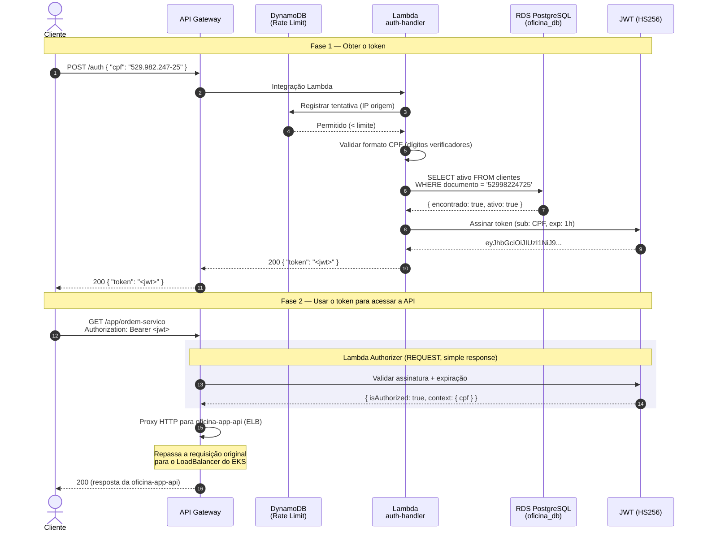
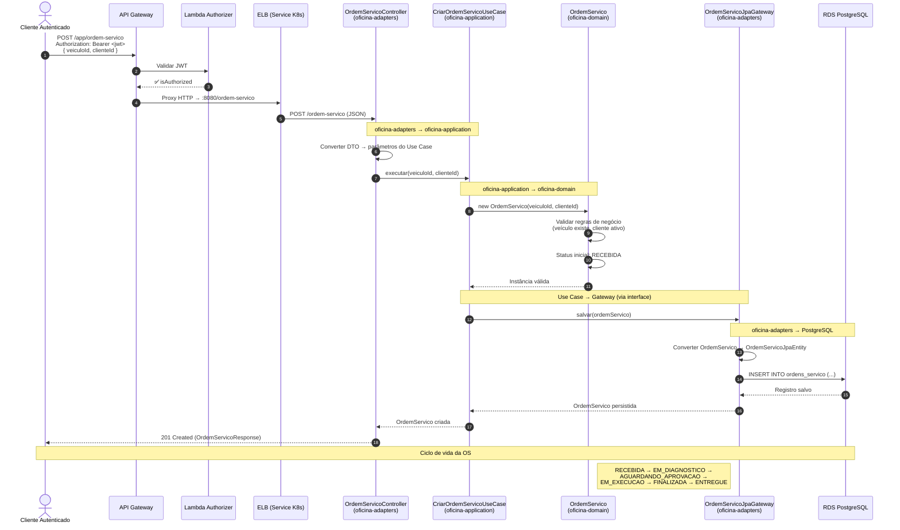
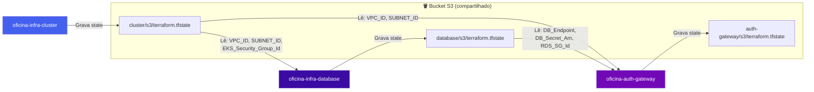
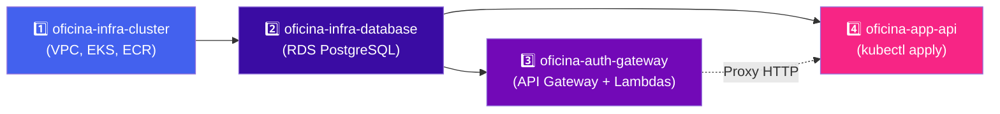

# 🏗️ Arquitetura do Ecossistema Oficina

Visão completa da arquitetura que atravessa todos os repositórios do projeto Oficina.
Para a arquitetura interna da aplicação (Clean Architecture, módulos Maven, data flow),
consulte [arquitetura.md](arquitetura.md).

---

## Repositórios e responsabilidades

O sistema é composto por 4 repositórios com ciclos de vida independentes:

| Repositório | Responsabilidade | Tecnologia |
|---|---|---|
| [`oficina-app-api`](https://github.com/GrupoPosTech-FIAP/oficina-app-api) | API REST da oficina mecânica, manifestos Kubernetes | Java 25, Spring Boot 4, K8s (Kustomize) |
| [`oficina-infra-cluster`](https://github.com/GrupoPosTech-FIAP/oficina-infra-cluster) | Rede (VPC, Subnets), cluster EKS, ECR | Terraform, AWS |
| [`oficina-infra-database`](https://github.com/GrupoPosTech-FIAP/oficina-infra-database) | Banco de dados RDS PostgreSQL, Security Group | Terraform, AWS RDS |
| [`oficina-auth-gateway`](https://github.com/GrupoPosTech-FIAP/oficina-auth-gateway) | Gateway de autenticação por CPF (API Gateway + Lambda) | Node.js 20, TypeScript, Terraform |

---

## Diagrama de Componentes (Visão de Nuvem)

O diagrama abaixo mostra todos os componentes provisionados na AWS e como eles se conectam.
As cores indicam qual repositório é responsável por cada componente.

**Legenda de cores:**
- 🟣 Roxo escuro (`oficina-auth-gateway`) — API Gateway, Lambdas, Rate Limiting
- 🔵 Azul (`oficina-infra-cluster`) — VPC, EKS, ECR
- 🟣 Roxo (`oficina-infra-database`) — RDS, Security Group do banco
- 🩷 Rosa (`oficina-app-api`) — Pod da aplicação, HPA, Service, Monitoramento

---

## Diagrama de Sequência — Autenticação por CPF

O fluxo de autenticação por CPF é implementado inteiramente no `oficina-auth-gateway`,
sem alterações na `oficina-app-api`. O cliente primeiro obtém um JWT e depois o usa para
acessar a API.

**Cenários de erro:**

| Situação | Código | Onde o fluxo para |
|---|---|---|
| IP excedeu limite de tentativas | `429` | Lambda `auth-handler` (step 3) |
| CPF mal formado | `400` | Lambda `auth-handler` (step 4) |
| CPF não cadastrado | `404` | Lambda `auth-handler` (step 5-6) |
| Cliente inativo | `403` | Lambda `auth-handler` (step 6) |
| Token ausente/inválido/expirado | `401` | Lambda Authorizer (step 14) |

---

## Diagrama de Sequência — Abertura de Ordem de Serviço

Este fluxo mostra o caminho de uma requisição desde o cliente autenticado até a persistência
no banco, passando por todas as camadas da Clean Architecture.

---

## Dependências entre repositórios (Terraform Remote State)

Os repositórios de infraestrutura formam uma cadeia de dependências via `terraform_remote_state`.
Os outputs de um repositório são consumidos como data sources pelo próximo.

---

## Ordem obrigatória de deploy

A infraestrutura **deve** ser provisionada nesta ordem. Cada etapa depende dos outputs da anterior.

| Passo | Repo | Comando | Tempo | Depende de |
|---|---|---|---|---|
| 1 | `oficina-infra-cluster` | `terraform apply` | ~10-15 min | Bucket S3 criado |
| 2 | `oficina-infra-database` | `terraform apply` | ~10-15 min | Passo 1 concluído |
| 3 | `oficina-auth-gateway` | GitHub Actions (CD) | ~3-5 min | Passos 1 e 2 concluídos |
| 4 | `oficina-app-api` | `kubectl apply -k k8s/overlays/aws` | ~2-3 min | Passos 1 e 2 concluídos |

> ⚠️ A destruição deve ser feita na **ordem inversa** (4 → 3 → 2 → 1).

---

## Contexto: AWS Academy Learner Lab

Toda a infraestrutura roda em um sandbox da AWS com as seguintes restrições:

- **Orçamento virtual** de ~$100 (sem cartão de crédito)
- **Credenciais expiram a cada ~4h** — exigem atualização manual nos GitHub Secrets
- **Região fixa:** `us-east-1` (Norte da Virgínia)
- **Não é possível criar IAM Roles** — todos os repos usam a role pré-existente `LabRole`
- **Alguns serviços avançados são bloqueados** (ex: AWS WAF)

Guia completo de acesso em [`oficina-infra-cluster/docs/acesso-aws-learner-lab.md`](https://github.com/GrupoPosTech-FIAP/oficina-infra-cluster/blob/main/docs/acesso-aws-learner-lab.md).
